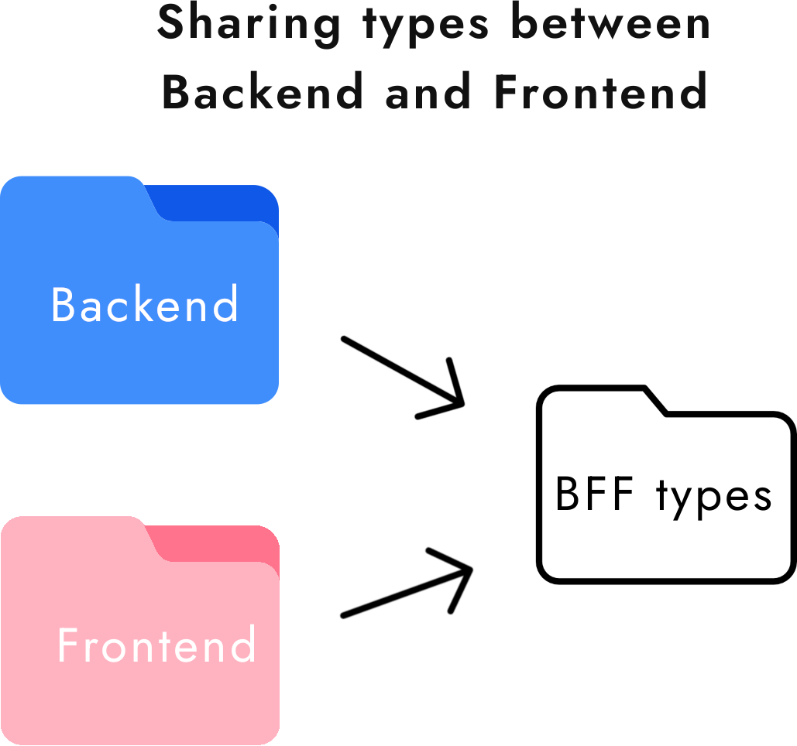

# BFF types
<p align="center">
    
</p>

<!-- omit in toc -->
## Table of Contents
- [🛸 Motivation](#-overview)
- [👾 Usage](#-usage)
- [🪪 License](#-license)

## 🛸 Motivation
<p align="center">
    
</p>
The motivation is simple: when working on a **Typescript** project usually we have common types shared between different projects (e.g. *backend* and *frontend*). What happens is that when something changes in one of the projects it becomes painful and time-consuming to find the source of the problem. ``bff-types`` is a simple template that you can **customize** and install into your projects to have everything aligned. For example I always like to work using the **monorepo** approach and my folder structure is the following:

```
.
├── backend
├── frontend
└── bff-types
```

## 👾 Usage
The usage is very simple. You just need to:
1. Clone the repo
2. Change the info in the ``package.json`` (like *name*, *description*, *version* and so on)
3. Customize the ``index.d.ts`` with your own types
4. Install it in your projects!

To install a local package (using the directory structure presented before) you just need to run:
```
yarn add ../bff-types
```

Of course you need to **reinstall it** in your project every time there you make an update.

## 🪪 License
**BFF types** is an open-source and free software released under the [MIT License](https://github.com/thelicato/bff-types/blob/main/LICENSE).